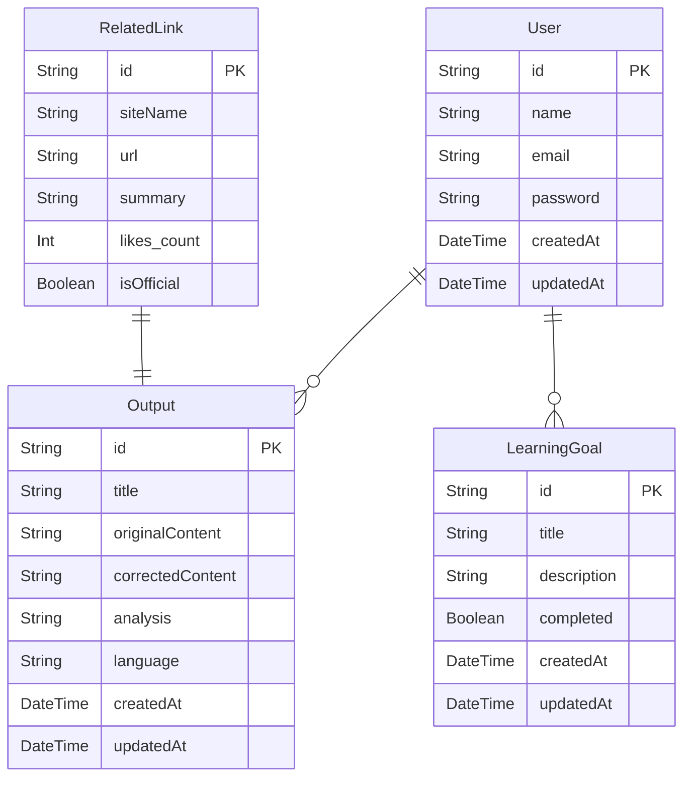

# Codev -Web Developer's Output App-

## アプリケーション概要
Web開発初学者向けの音声アウトプット＆フィードバックアプリです。学習内容を音声で記録し、AIによる文字起こし・分析・改善提案を受けることができます。継続的な学習と振り返りをサポートします。

## ⚡️ Live Demo

### デモ動画を添付予定。

## 💡 このアプリを制作した理由
### 背景
産業のDX化に伴い、IT関連の「リスキリング」に対する需要が高まっています。リスキリングとは、「新しい職業に就くために、あるいは、今の職業で必要とされるスキルの大幅な変化に適応するために、必要なスキルを獲得すること」*1です。ただ、多くのビジネスマンにとって、時間的・心理的制約から、仕事と並行して学習を進めることは難しいはずです。ただでさえ本業で忙しい現代の社会人がリスキリングを成功させるためには、**効率的に学習をすすめること**が求められます。

効率よく学習を進めるためには、**能動的なアウトプットが重要**です。IT関連・Web開発の技術を学ぶ際のアウトプット手法として、QiitaやZennに技術記事を投稿する、初学者コミュニティに所属して交流する等様々あります。しかし、特に初学者のうちは体系的な知識がない分、技術記事等でアウトプットすることが難しい上に、記事作成にも時間がかかります。また、一緒に学習する仲間を見つけたとしても、**覚えたての知識を知らない人にアウトプットするのは少しハードルが高い**と感じる方もいるのではないでしょうか。

以上の背景から、解決されるべき課題とアプリの目的を設定し、本アプリを作成しました。

### ペルソナ
- Webアプリ開発に興味を持ち、勉強し始めた社会人*2

### 課題
- 学習内容を気軽にアウトプットできる機会が少ない。

### 目的
- Web開発初学者が、手軽に効率よくアウトプットできる環境を作ること。

### 課題の解決方法
- 音声入力による手軽なアウトプット
- AIによる即時フィードバック
- 学習進捗の可視化によるモチベーションの維持

---

*1 経済産業省: 第2回 デジタル時代の人材政策に関する検討会
https://www.meti.go.jp/shingikai/mono_info_service/digital_jinzai/pdf/002_02_02.pdf

*2 学習開始直後の私です。

## 🔑 主な機能
1. **音声アウトプット機能**
   - 最大60秒の音声録音
   - Whisper*3による高精度な文字起こし
   - GPT-4-miniによる文字起こし修正
   
2. **AI分析・フィードバック**
   - GPT-4-miniによるアウトプット内容分析と改善提案
   - 技術用語の説明と補足
   - 関連記事の提案
     - 公式ドキュメント
     - Qiita記事

3. **学習管理機能**
   - 学習目標の設定と進捗管理
   - カレンダーヒートマップによる学習記録の可視化

4. **プロフィール・ポートフォリオ機能**
   - 学習の軌跡を可視化
   - 習得スキルのタグ表示
   - 継続日数の表示

---

*3 WhisperはOpenAIの音声認識AIです。

## 🛠 使用技術

### フロントエンド
Next.js 14.2.14 /
React/
TypeScript /
TailwindCSS /
shadcnui

### バックエンド
Next.js API Routes /
Prisma /
PostgreSQL/ 
NextAuth.js

### AI/API
- OpenAI GPT-4-mini
- OpenAI Whisper API
- Qiita API

### インフラ/開発環境
- Vercel
- AWS (ECS Fargate)

## 📊 データベース設計

## ✨ 工夫したポイント

### 1. UX/UI設計
- **シンプルな操作フロー**: 音声入力までたったの3ステップ
- **レスポンシブ対応**: スマートフォンでも快適に利用可能
- **ダークモード対応**: 目の疲れを考慮

### 2. 各APIからの出力調整
- **分析結果の安定性**: GPT4-miniからの出力をjson形式に指定することで、出力の安定性を向上。
- **リンク切れ対策**: 独自の検索アルゴリズムでQiita記事のリンク切れを防止

## 🔄 今後の展望

**勉強のために下記実施予定**
- CI/CDによる開発体験の向上
