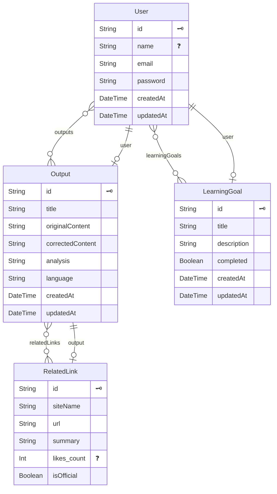

```mermaid
erDiagram

  "User" {
    String id "🗝️"
    String name "❓"
    String email 
    String password 
    DateTime createdAt 
    DateTime updatedAt 
    }
  

  "Output" {
    String id "🗝️"
    String title 
    String originalContent 
    String correctedContent 
    String analysis 
    String language 
    DateTime createdAt 
    DateTime updatedAt 
    }
  

  "RelatedLink" {
    String id "🗝️"
    String siteName 
    String url 
    String summary 
    Int likes_count "❓"
    Boolean isOfficial 
    }
  

  "LearningGoal" {
    String id "🗝️"
    String title 
    String description 
    Boolean completed 
    DateTime createdAt 
    DateTime updatedAt 
    }
  
    "User" o{--}o "Output" : "outputs"
    "User" o{--}o "LearningGoal" : "learningGoals"
    "Output" o|--|| "User" : "user"
    "Output" o{--}o "RelatedLink" : "relatedLinks"
    "RelatedLink" o|--|| "Output" : "output"
    "LearningGoal" o|--|| "User" : "user"
```
